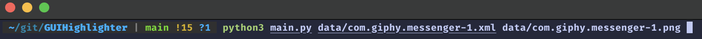

# GUIHighlighter
A small tool that highlights leaf level GUI-components in an Android application screenshot by parsing and processing metadata (in the form of xml files) that describes the hierarchical screen structure
!

    

    

[Before](before.png)  

## Requirements
Must use Python3 
In order to run this code you will have to install the following librarie
- PIL ( Pillow )

## How to run
Using terminal, type in the following command :

-python3 main.py input.xml output.png

 

Ensure you use files from the same set when using inputs from the data file 

## Description of Implementation 
Use of Pillow was due to it's simple nature, and vast documentation 

Use of ElementTree was due to it's versitility and vast documentation

This program works by first reading the xml file and finding the leaf nodes. 
Then using this information, and PIL, we draw on the image

This is done by recursivly searching the xml file, finding all the leaf nodes and storing them in a list 
Next we itterate through this list and by using regular expressions store the coordinates of where these components are 
Finally we use these coordinates to highlight the gui components. 
